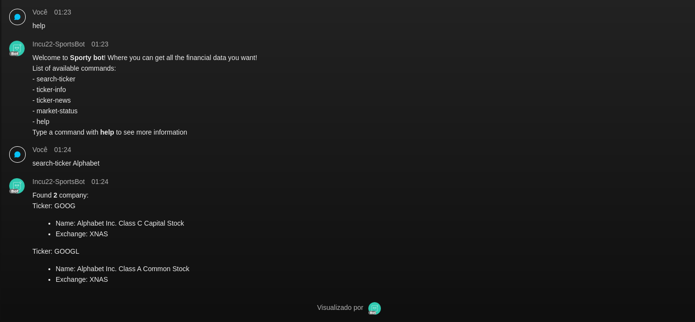
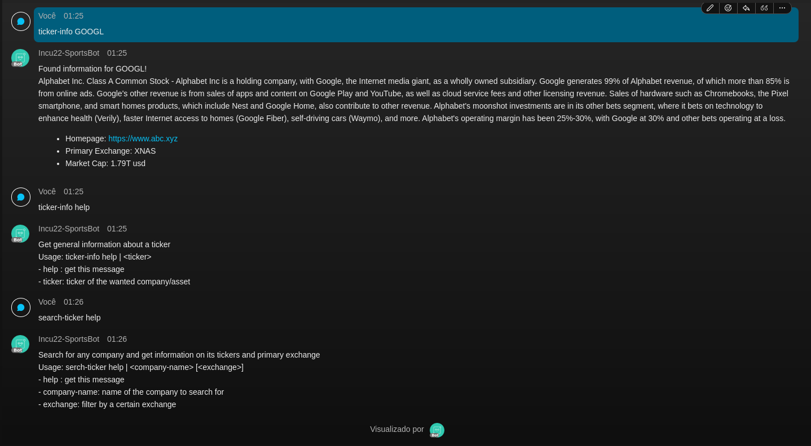
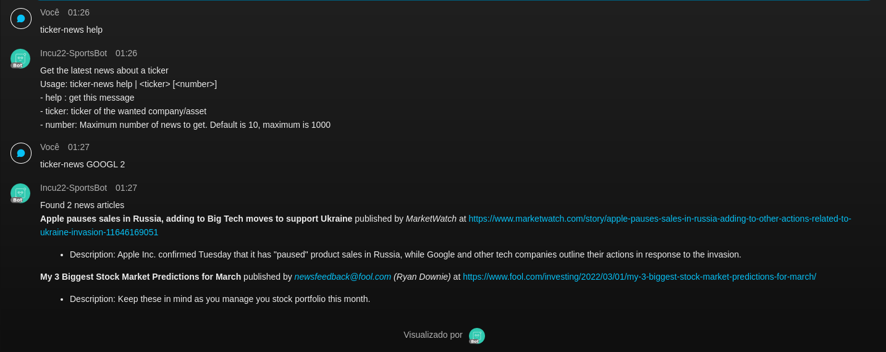
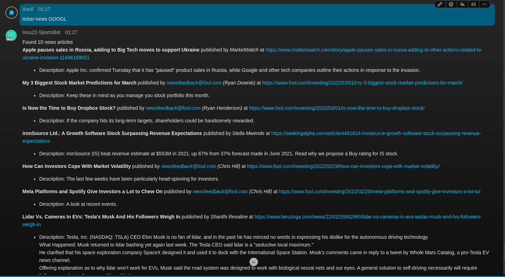
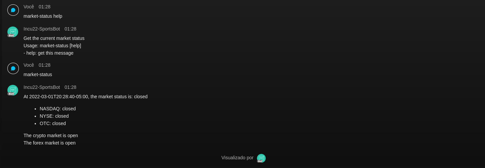

# Sporty Bot

This is a simple bot for the Incubator 9.0 program, Automation Track. This bot gives some basic information on finances, including searching for the ticker of a company, getting details on such ticker, getting current news regarding the ticker and showcasing the current market status.

## Usage

In `sporty_flask.py`, change the relevant variables with your own identifiers:

* `bot_name`
* `room_id`
* `auth_token` (redacted for security reasons)
* `polygon_api` (redacted for security reasons)

Run with `flask run`

**NOTE:** Make sure you have `ngrok` running and forwarding to port `5000`, as well has the webhook properly configured

## Demo

### 1 - Help and Search Ticker

This screenshot showcases the initial help message the bot gives when typing `help` as well as a search for the ticker of a known public-traded company, `Alphabet`. The command gives the number of matches for the given query, with the ticker, name and exchange of each result

### 2 - Ticker Info and Command Help

This screenshot demonstrates the `ticker-info` command. By passing to it the ticker found in the previous command, the user can see a small description of the stock, its primary exhange, its homepage, as well as the current market cap.
This also shows the command specific `help` option, that prints the syntax of the given command, with the supported arguments and their meaning, to help the user correctly query for the wanted information.

### 3 - Ticker News

The screenshot shows the `ticker-news` command, that returns a number of recent news, ordered by publication date, regarding the given ticker. The `help` option demonstrates the available options, and the next commmand returns to the user the 2 most recent news regarding the `GOOGL` ticker, with their titles, authors and URLs, as well as a small description of the news.

### 4 - More Ticker News

The screenshot adds to the last section, by showing that, if no argument is given, the program assumes a default 10 news articles to show, and prints all of the information about each one of them.

### 5 - Market Status

The final screenshot prints out the current status of the global trading markets. It shows both the general status, as well as an individualized status for the 3 most proeminent exchanges: `NASDAQ`, `NYSE` and `OTC`. It also showcases the current status of the Crypto and Forex markets.
